# 🚀 SigmaTrack — Система управления проектами и задачами (Project Tracker)

Современный высокопроизводительный таск-трекер для командной разработки. Проект спроектирован по принципам **Clean Architecture** и **DDD (Domain-Driven Design)**, обеспечивая высокую масштабируемость и независимость слоев. 

Приложение разделено на два изолированных слоя: клиент на **Nuxt 4** и бэкенд ASP.NET Web API на **.NET 10**. Вся инфраструктура полностью контейнеризирована.

---

## 📌 Содержание
1. [🏗️ Архитектура системы](#️-архитектура-системы)
   * [Backend (API Layer)](#-backend-api-layer)
   * [Frontend (Client Layer)](#-frontend-client-layer)
2. [🛠️ Стек технологий](#️-стек-технологий)
3. [📸 Интерфейс системы (Скриншоты)](#-интерфейс-системы-скриншоты)
4. [📌 Реализованный функционал (Текущая версия)](#-реализованный-функционал-текущая-версия)
5. [📖 Документация и Бэклог](#-документация-и-бэклог)
6. [🚀 Как запустить проект](#-как-запустить-проект)
   * [Вариант 1: Быстрый запуск через Docker](#вариант-1-быстрый-запуск-через-docker-рекомендуемый)
   * [Вариант 2: Локальная разработка (Раздельный запуск)](#вариант-2-запуск-для-локальной-разработки-раздельный)

---

## 🏗️ Архитектура системы

### ⚙️ Backend (API Layer)
Решение на .NET 10 разделено на 4 независимых проекта для обеспечения слабой связанности и строгого контроля зависимостей:
1. **`SigmaTrack.Domain`** (Ядро системы): Чистый C# без внешних зависимостей. Содержит доменные сущности, перечисления и бизнес-исключения.
2. **`SigmaTrack.Application`** (Бизнес-логика): Реализован по принципу **Vertical Slices (Features)**. Каждая фича (например, `CreateIssue`) изолирована и содержит UseCase, хэндлеры, DTO и FluentValidation.
3. **`SigmaTrack.Infrastructure`** (Инфраструктура): Реализует интерфейсы доступа к данным (контекст БД EF Core, миграции PostgreSQL) и внешние интеграции.
4. **`SigmaTrack.WebApi`** (Точка входа): Minimal APIs, конфигурация DI-контейнера, JWT-аутентификация, Claims-авторизация, интеграция со Scalar и `GlobalExceptionHandler` (формат RFC 7807).

### 💻 Frontend (Client Layer)
* **Framework:** Nuxt 4 (Vue 3, Composition API) с полной типизацией на **TypeScript** .
* **UI & Styles:** Nuxt UI + Tailwind CSS (Адаптивный дизайн, поддержка темной/светлой темы) .
* **State Management:** Pinia (Модульные сторы для управления проектами, задачами и уведомлениями) .
* **Internationalization:** Nuxt i18n (Архитектура с разделением локалей на отдельные файлы конфигурации RU/EN) .

---

## 🛠️ Стек технологий

* **Runtime & СУБД:** .NET 10 (C#) + PostgreSQL 
* **ORM & Валидация:** Entity Framework Core + FluentValidation 
* **Фронтенд:** Node.js + Nuxt 4 + Tailwind CSS + Pinia 
* **DevOps & Инфраструктура:** Docker + Docker Compose (Docker Volume) + Nginx (Reverse Proxy) 

---

## 📸 Скриншоты интерфейса

### 🔑 Авторизация и доступ
<p align="center">
  <a href="./screenshots/Login.png">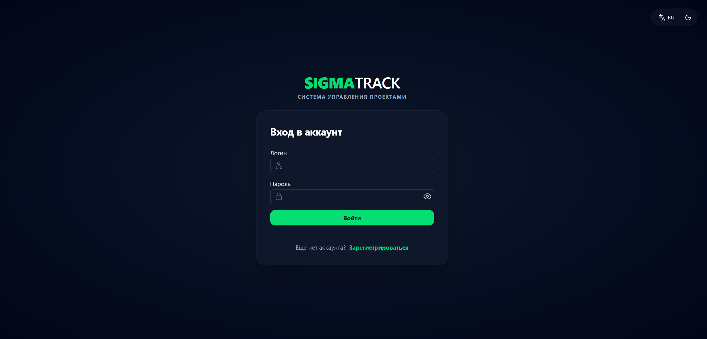</a>
  <a href="./screenshots/Register.png">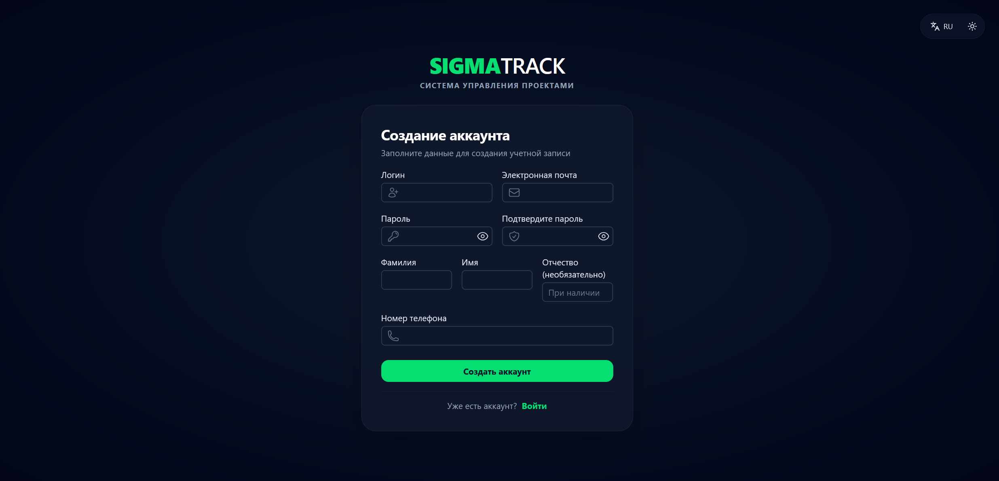</a>
</p>

### 📋 Задачи и рабочие области
<p align="center">
  <a href="./screenshots/MyTasks.png">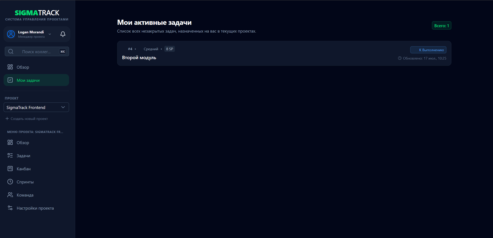</a>
  <a href="./screenshots/ProjectTasks.png">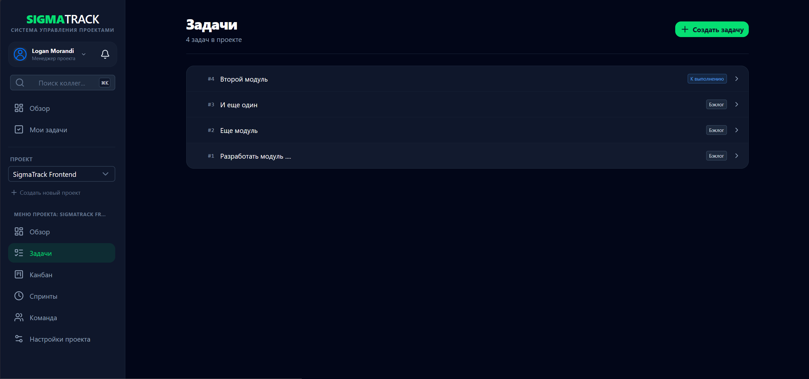</a>
  <a href="./screenshots/SearchUsers.png">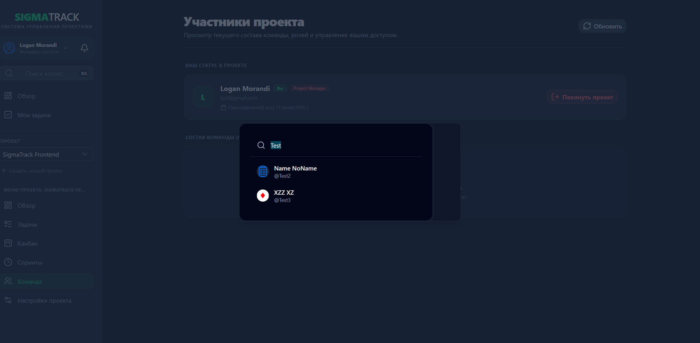</a>
</p>

### 🏃‍♂️ Управление спринтами (Scrum)
<p align="center">
  <a href="./screenshots/Sprints.png">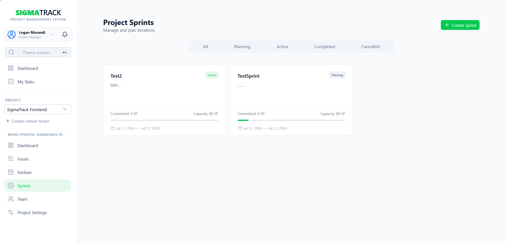</a>
  <a href="./screenshots/SprintDetail.png">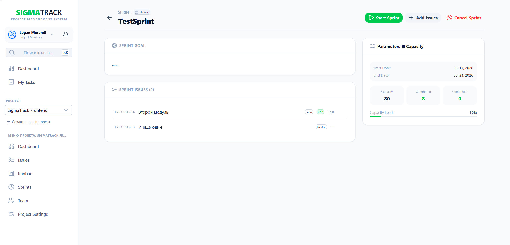</a>
</p>

### 📎 Детализация задачи
<p align="center">
  <a href="./screenshots/issueDetail1.png">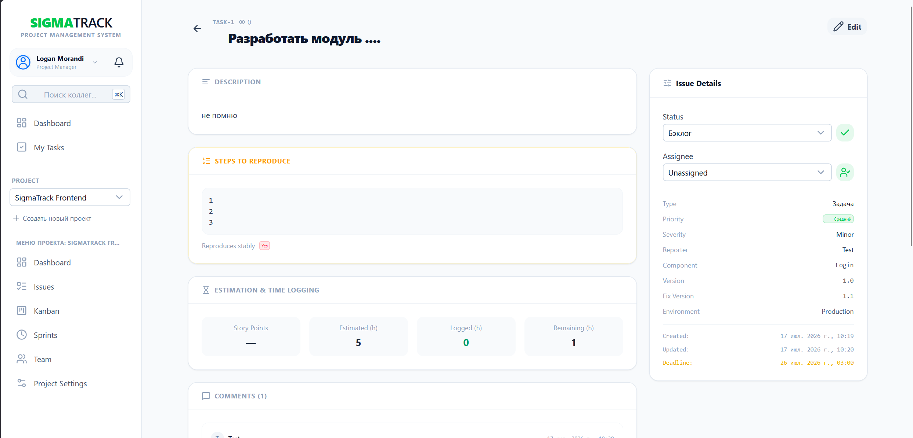</a>
  <a href="./screenshots/IssueDetail2.png">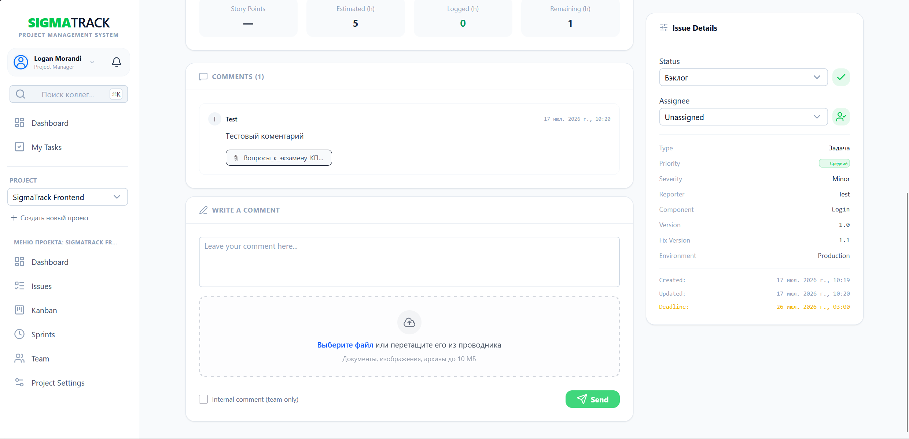</a>
</p>

### 👥 Команда и профили
<p align="center">
  <a href="./screenshots/ProjectTeam.png">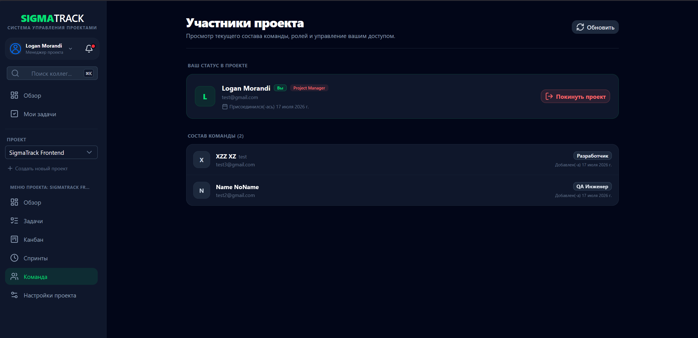</a>
  <a href="./screenshots/MyProfile.png">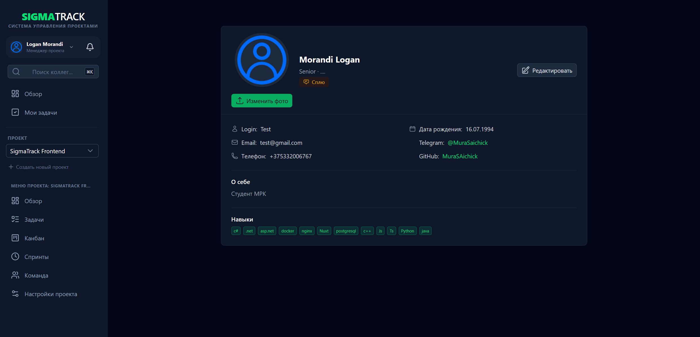</a>
  <a href="./screenshots/SearchProfile.png">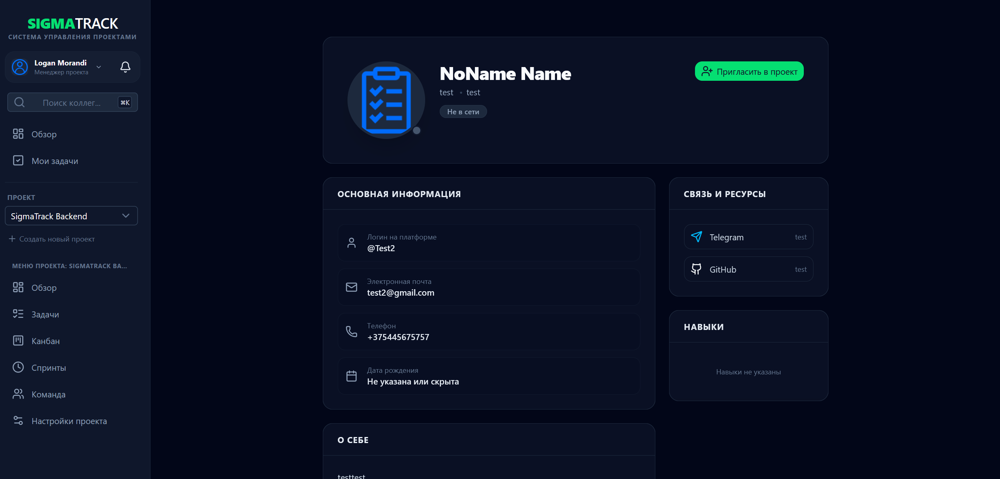</a>
</p>

### ⚙️ Настройки и безопасность
<p align="center">
  <a href="./screenshots/ProjectSettings.png">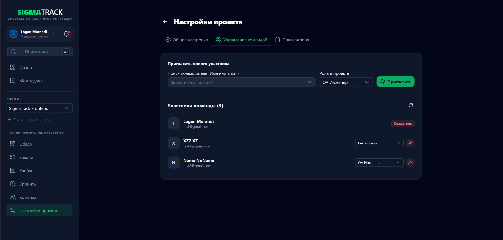</a>
  <a href="./screenshots/SecuritySettings.png">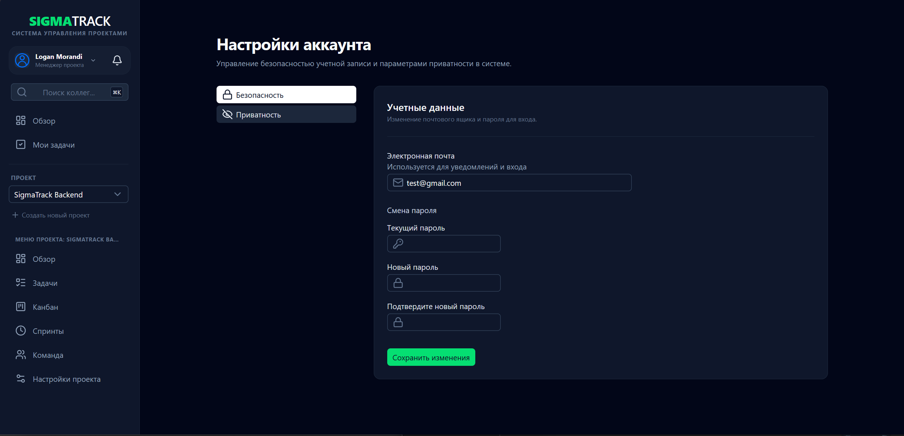</a>
  <a href="./screenshots/PrivacySettings.png">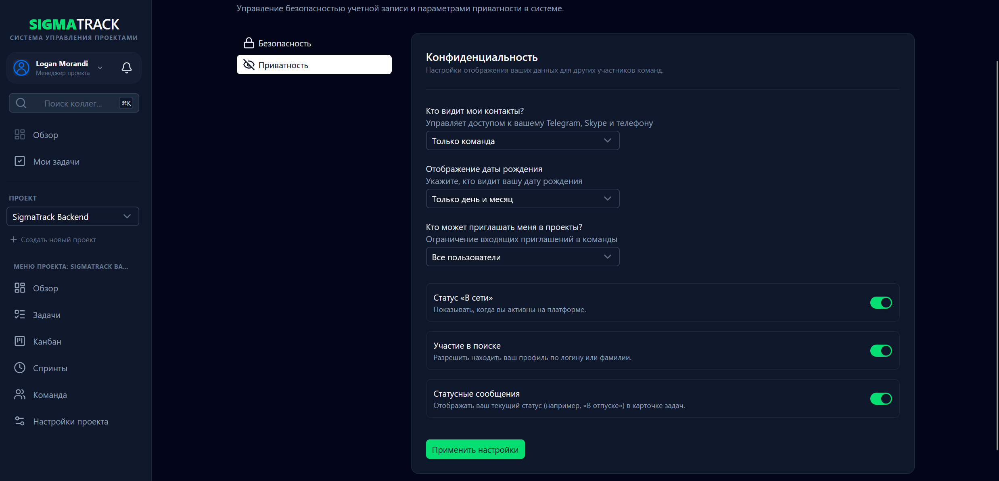</a>
</p>

### 📱 Навигация и уведомления (вертикальные панели)
<p align="center">
  <a href="./screenshots/DropDownMenu.png">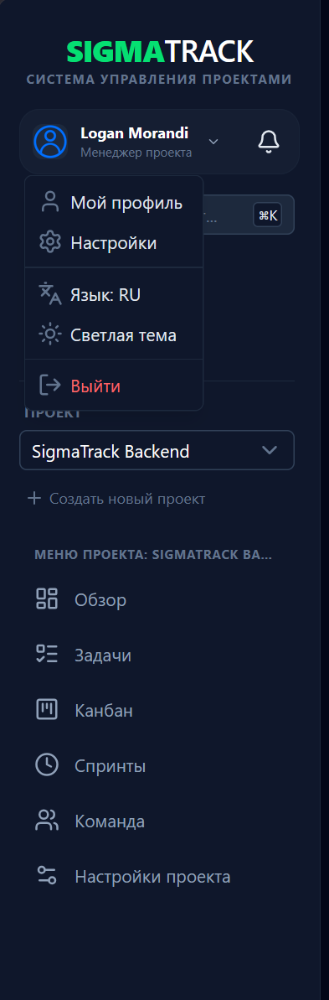</a>
  <a href="./screenshots/Notifications.png">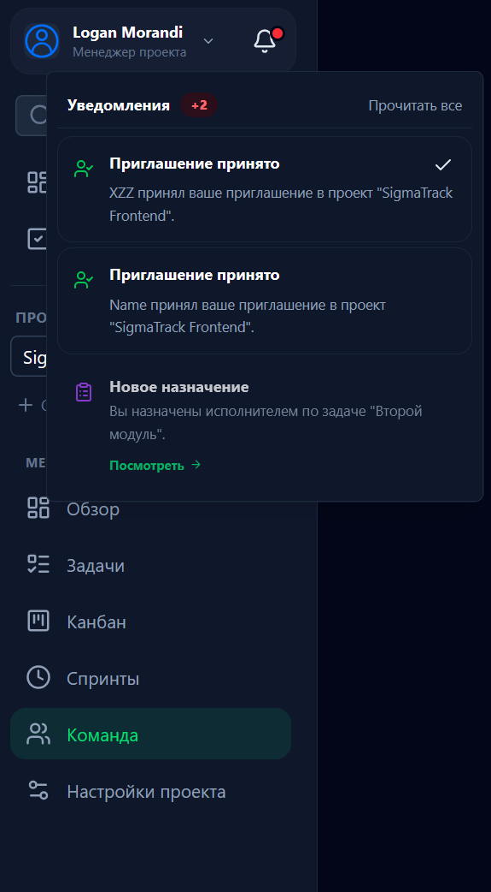</a>
</p>

## 📌 Реализованный функционал (Текущая версия)

* **Аутентификация и пользователи:** 
  * Регистрация, авторизация (JWT + Claims).
  * Управление личным профилем и расширенные настройки (включая параметры приватности и навыки).
  * Публичный просмотр профиля любого другого пользователя.
  * Поиск сотрудников по всей системе для приглашения в проекты.
* **Управление проектами:** Создание, редактирование и удаление проектов; управление участниками и ролями (Project Manager, Developer, QA, Observer); система инвайтов в команду (принять/отклонить).
* **Работа с задачами (Issues):** Создание, просмотр деталей, редактирование и удаление задач. Автогенерация уникальных номеров задач внутри проекта (префиксы), назначение исполнителей, Story Points, тегирование и комментарии. Вывод сквозных «Активных задач пользователя» со всех проектов на один экран.
* **Управление спринтами (Scrum-процесс):** Создание и планирование спринтов, установка целей (Sprint Goal), дат и емкости команды (Capacity). Динамическое добавление/удаление задач из бэклога. Полноценный жизненный цикл спринта: запуск (Start), завершение (Complete) и отмена (Cancel).
* **Работа с файлами & Обсуждения:** Интеграция системы комментариев внутри задач с возможностью прикрепления вложений (файлов, изображений).
* **Система уведомлений & UI/UX:** Умный роутинг (при переходе по уведомлению из другого проекта система автоматически переключает контекст активного проекта в шапке).
* **DevOps-инфраструктура:** Полная контейнеризация всех сервисов, оркестрация через `docker-compose`, и маршрутизация/CORS через Nginx в качестве Reverse Proxy.

---

## 📖 Документация и Бэклог

Для удобства поддержки техническая документация и планы по развитию разделены на специализированные файлы:
* ⏳ **[План разработки и подробный Бэклог](./BACKLOG.md)** — статусы по Канбан-доске, аналитике, спринтам и файловому хранилищу.
* ⚙️ **[Документация по Backend (API)](./backend/BACKEND.md)** — структура слоев, архитектурные решения, Scalar-интеграция, миграции и Docker-контейнеры.
* 💻 **[Документация по Frontend](./frontend/FRONTEND.md)** — особенности Nuxt 4, Pinia-сторы, архитектура локализации (i18n) и сборка билда.

---

## 🚀 Как запустить проект

### Вариант 1: Быстрый запуск через Docker (Рекомендуемый)

1. Убедитесь, что у вас установлены Docker и Docker Compose.
2. В **корневой папке** проекта (рядом с `docker-compose.yml`) создайте файл `.env` для инициализации контейнеров:

```bash
# Конфигурация базы данных PostgreSQL
DB_NAME=SigmaTrackDb
DB_USER=postgres
DB_PASSWORD=your_secure_password

# Окружение бэкенда
BACKEND_ENV=Development

```

3. Выполните команду для сборки и запуска всей инфраструктуры:


```bash
docker-compose up -d --build
```

После сборки Nginx начнет слушать порт `80`, и приложение будет доступно по адресу `http://localhost`.

---

### Вариант 2: Запуск для локальной разработки (Раздельный)

#### 1. Настройка бэкенда (`backend/`)

1. Перейдите в папку `backend/SigmaTrack.WebApi`.

2. Скопируйте `appsettings.json` в `appsettings.Development.json` и укажите вашу строку подключения к PostgreSQL в `ConnectionStrings:DefaultConnection`.

3. Примените миграции к базе данных:

```bash
dotnet ef database update --project SigmaTrack.Infrastructure --startup-project SigmaTrack.WebApi

```

4. Запустите API:

```bash
dotnet run --project SigmaTrack.WebApi

```

#### 2. Настройка фронтенда (`frontend/`)

1. Перейдите в папку `frontend/`, скопируйте `.env.example` в `.env` и укажите адрес запущенного API:

```bash
NUXT_PUBLIC_API_BASE=http://localhost:5069
```

2. Установите зависимости и запустите сервер разработки:

```bash
npm install
npm run dev

```